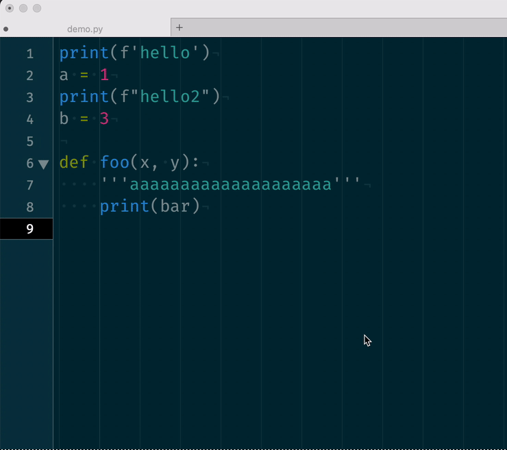
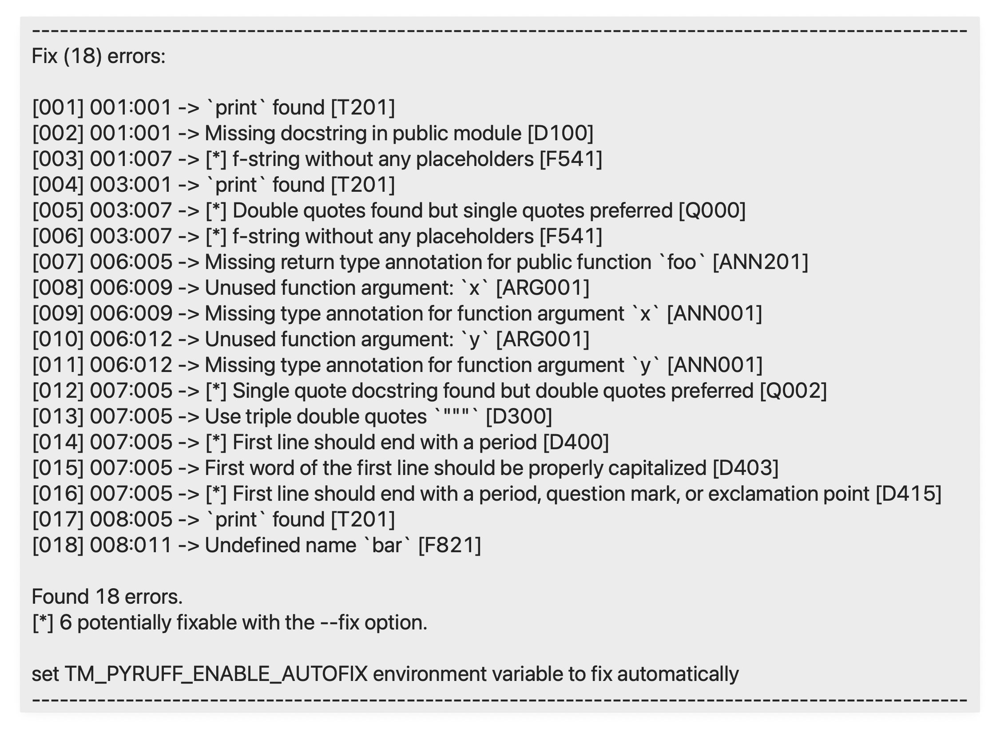

# Python Ruff Linter for TextMate2

[Ruff][01] is an extremely fast Python linter, written in Rust. This is the
TextMate bundle implementation of ruff linter. 

Bundle calls ruff linter after save operation. Ruff has auto fix feature. If
you set `TM_PYRUFF_ENABLE_AUTOFIX` TextMate environment variable, bundle
applies auto fix first, than lints the code and pops up result!





---

## Installation

You need to install `ruff`. I prefer `brew`. It’s also available via `pip`;

```bash
$ brew install ruff
$ cd ~/Library/Application\ Support/TextMate/Bundles/
$ git clone https://github.com/vigo/textmate2-ruff-linter.git Python-Ruff-Linter.tmbundle
```

### TextMate Environment Variables

| Variable | Description | Default Value |
|:---------|:------------|---------------|
| `TM_PYRUFF` | Path of executable; example: `/opt/homebrew/bin/ruff` | not set |
| `TM_PYRUFF_ENABLE_AUTOFIX` | Enable automatically fix lint violations | `false` |
| `TM_PYRUFF_TOOLTIP_LINE_LENGTH` | TextMate tool tip width in chars | `120` |
| `TM_PYRUFF_TOOLTIP_BORDER_CHAR` | Top and bottom line’s char | `-` |
| `TM_PYRUFF_TOOLTIP_LEFT_PADDING` | Padding value for lines to fit in tool tip window | `20` |
| `TM_PYRUFF_DEBUG` | Enable debug mode | `false` |
| `TM_PYRUFF_DISABLE` | Disable bundle | `false` |

TextMate sometimes doesn’t apply environment variable creation from
command-line. If this doesn’t work, you need to apply/set manually from
**TextMate > Settings** pull down menu.

```bash
$ defaults write com.macromates.TextMate environmentVariables \
    -array-add "{enabled = 1; value = \"$(command -v ruff)\"; name = \"TM_PYRUFF\"; }"

# enable auto fix
$ defaults write com.macromates.TextMate environmentVariables \
    -array-add "{enabled = 1; value = \"true\"; name = \"TM_PYRUFF_ENABLE_AUTOFIX\"; }"
```

---

## Change Log

**2023-02-25**

If you press <kbd>⌃</kbd> + <kbd>⇧</kbd> + <kbd>N</kbd> (control + shift + N) 
you can run **NOQAlizer all**. This adds `# noqa:` directive to your all invalid
rules:

```python
print(f'hello')  # noqa: D100, T201, F541
a = 1
print(f"hello2")  # noqa: Q000, T201, F541
b = 3

def foo(x, y):  # noqa: ANN001, ARG001, ANN201
    '''aaaaaaaaaaaaaaaaaaaa'''  # noqa: D300, D403, D400, Q002, D415
    print(bar)  # noqa: T201, F821

```

If you press <kbd>⌃</kbd> + <kbd>⇧</kbd> + <kbd>R</kbd> (control + shift + R) 
you can display existing errors description in a new window! You can also run
this from pull down menu: **Show rules for existing errors**

You can disable bundle via setting an environment variable or adding a comment
into first line of code:

```python
# TM_PYRUFF_DISABLE
print(f'hello')
a = 1
print(f"hello2")
b = 3

def foo(x, y):
    '''aaaaaaaaaaaaaaaaaaaa'''
    print(bar)

```

You can easily turn on/off bundle w/o changing settings.

---

## Contributor(s)

* [Uğur "vigo" Özyılmazel](https://github.com/vigo) - Creator, maintainer

---

## Contribute

All PR’s are welcome!

1. `fork` (https://github.com/vigo/textmate2-ruff-linter/fork)
1. Create your `branch` (`git checkout -b my-features`)
1. `commit` yours (`git commit -am 'implement new features'`)
1. `push` your `branch` (`git push origin my-features`)
1. Than create a new **Pull Request**!

This project is intended to be a safe, welcoming space for collaboration, and
contributors are expected to adhere to the [code of conduct][coc].

---

## License

This project is licensed under MIT

---

[01]: https://beta.ruff.rs/docs/
[coc]: https://github.com/vigo/textmate2-ruff-linter/blob/main/CODE_OF_CONDUCT.md
